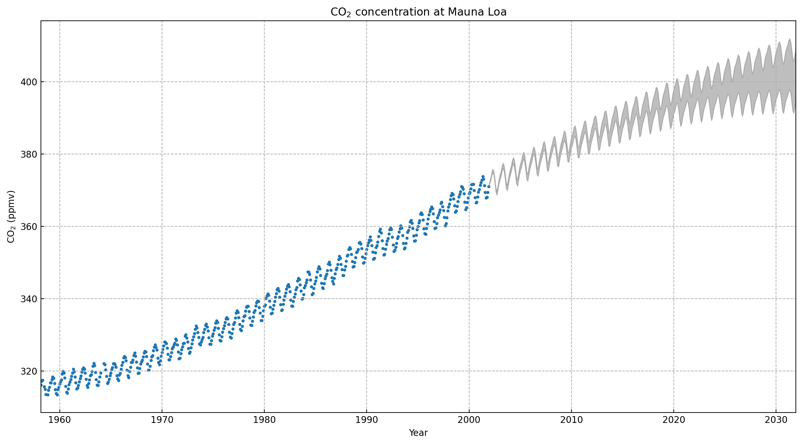

# GPie
[](https://github.com/zackxzhang/gpie)
[](https://www.python.org)
[](https://pypi.python.org/pypi/gpie)
[](https://opensource.org/licenses/BSD-3-Clause)

**G**aussian **P**rocess t**i**ny **e**xplorer

- **simple**: an intuitive syntax inspired by scikit-learn
- **powerful**: a compact core of expressive abstractions
- **extensible**: a modular design for effortless composition
- **lightweight**: minimal dependencies (standard library, numpy, scipy)

This is a ongoing research project with many parts currently **under construction** - please expect bugs and sharp edges.


### Features

- several "avant-garde" kernels such as spectral kernel and neural kernel allow for exploration of new ideas
- each kernel implements anisotropic variant besides isotropic one to support automatic relevance determination
- a full-fledged toolkit of kernel operators enables all sorts of "kernel engineering", for example, handcrafting composite kernels based on expert knowledge or exploiting special structure of datasets
- core computations such as likelihood and gradient are carefully formulated for speed and stability
- sampling inference embraces a probabilistic perspective in learning and prediction to promote robustness
- Bayesian optimizer offers a principled strategy to optimize expensive and black-box objectives globally


### Functionality
- kernel functions
    - white kernel
    - constant kernel
    - radial basis function kernel
    - rational quadratic kernel
    - Matérn kernel
        - Ornstein-Uhlenbeck kernel
    - periodic kernel
    - spectral kernel
    - neural kernel
- kernel operators
    - Hadamard (element-wise)
        - sum
        - product
        - exponentiation
    - *Kronecker*
        - *sum*
        - *product*
- Gaussian process
    - regression
    - *classification*
- *t process*
    - *regression*
    - *classification*
- Bayesian optimizer
    - surrogate: Gaussian process, *t process*
    - acquisition: PI, EI, LCB, *ES*, *KG*
- sampling inference
    - Markov chain Monte Carlo
        - Metropolis-Hastings
        - *Hamiltonian + no-U-turn*
    - simulated annealing
- *variational inference*

Note: parts of the project *in italic font* are under construction.


### Examples

##### Gaussian process regression on Mauna Loa CO<sub>2</sub>

In this example, we use Gaussian process to model the concentration of CO<sub>2</sub> at Mauna Loa as a function of time.
```python
# handcraft a composite kernel based on expert knowledge
# long-term trend
k1 = 30.0**2 * RBFKernel(l=200.0)
# seasonal variations
k2 = 3.0**2 * RBFKernel(l=200.0) * PeriodicKernel(p=1.0, l=1.0)
# medium-term irregularities
k3 = 0.5**2 * RationalQuadraticKernel(m=0.8, l=1.0)
# noise
k4 = 0.1**2 * RBFKernel(l=0.1) + 0.2**2 * WhiteKernel()
# composite kernel
kernel = k1 + k2 + k3 + k4
# train GPR on data
gpr = GaussianProcessRegressor(kernel=kernel)
gpr.fit(X, y)
```

In the plot, scattered dots represent historical observations, and shaded area shows the predictive interval (μ - σ, μ + σ) prophesied by a Gaussian process regressor trained on the historical data.

##### Sampling inference for Gaussian process regression

In this example, we use a synthesized dataset for ease of illustration and investigate sampling inference techniques such as Markov chain Monte Carlo. As a Gaussian process defines the predictive distribution, we can get a sense of it by sampling from its prior distribution (before seeing training set) and posterior distribution (after seeing training set).
```python
# with the current hyperparameter configuration,
# ... what is the prior distribution p(y_test)
y_prior = gpr.prior_predictive(X, n_samples=6)
# ... what is the posterior distribution p(y_test|y_train)
y_posterior = gpr.posterior_predictive(X, n_samples=4)
```


We can also sample from the posterior distribution of a hyperparameter, which characterizes its uncertainty beyond a single point estimate such as MLE or MAP.
```python
# invoke MCMC sampler to sample hyper values from its posterior distribution
hyper_posterior = gpr.hyper_posterior(n_samples=10000)
```


### Backend

GPie makes extensive use of de facto standard scientific computing packages in Python:

- numpy: linear algebra, stochastic sampling  
- scipy: gradient-based optimization, stochastic sampling


### Installation

GPie requires Python 3.6 or greater. The easiest way to install GPie is from a prebuilt wheel using pip:
```bash
pip install --upgrade gpie
```

You can also install from source to try out the latest features (requires `pep517>=0.8.0` and `setuptools>=40.9.0`):
```bash
pip install --upgrade git+https://github.com/zackxzhang/gpie
```


### Coming Soon
- an example of Bayesian optimization in comparison to gradient-based optimization
- a brief guide on varying characteristics of different kernels and how to compose them
- a demo of quantified Occam's razor encoded by Bayesian inference and its implication for model selection
- Sphinx-generated documentation
- ...
